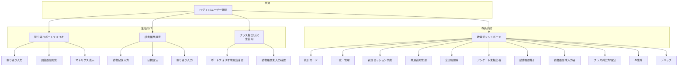
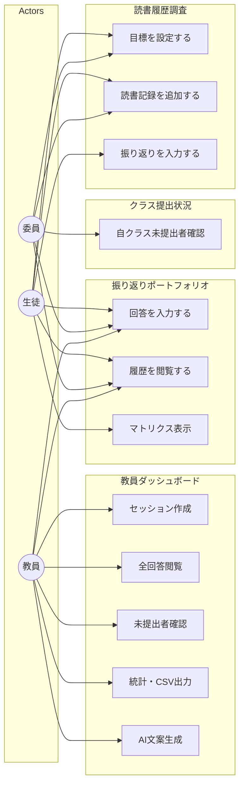
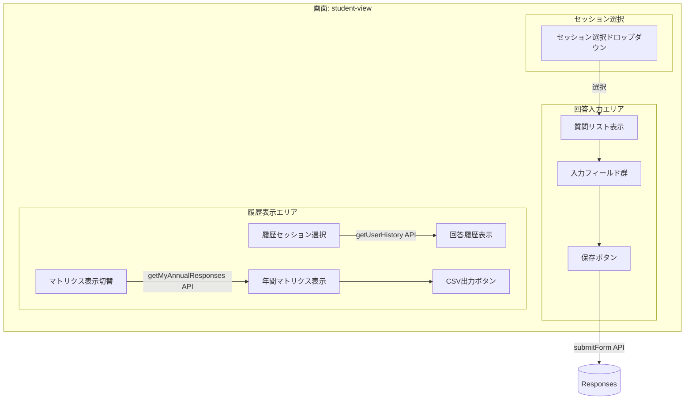
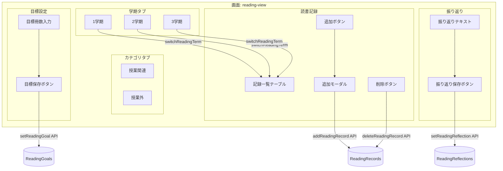
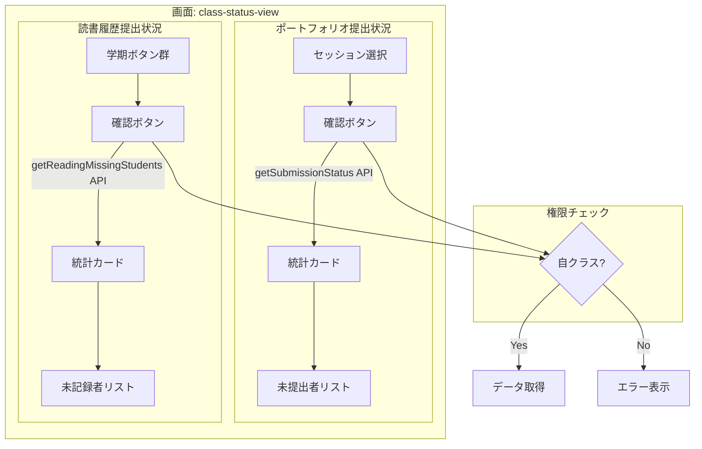
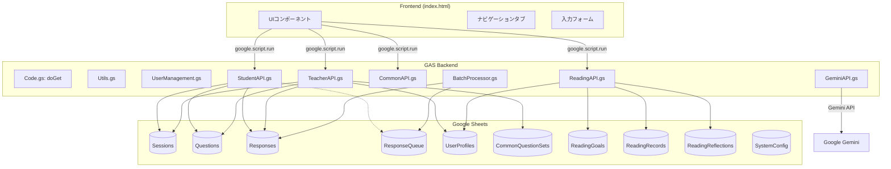
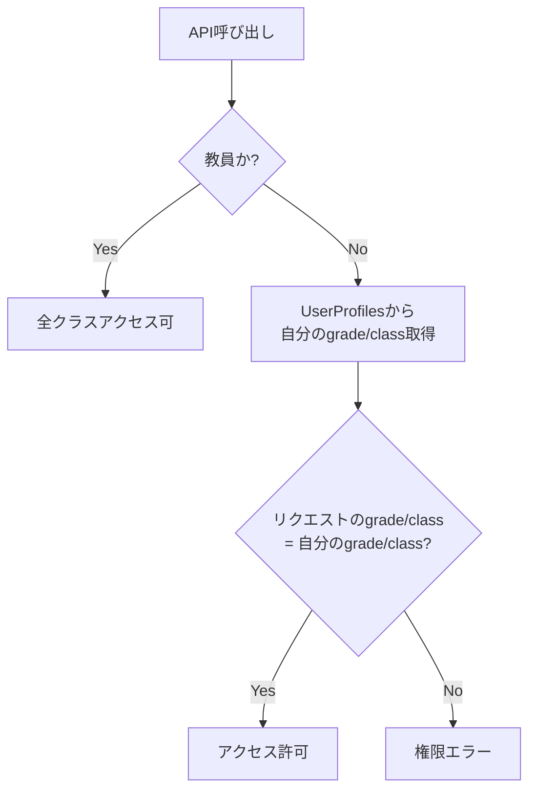

# ManabiFolio システム概要・アーキテクチャ

## システム概要

**ManabiFolio** は Google Apps Script (GAS) + Google Sheets ベースの学校向けポートフォリオ管理システム。
生徒の振り返り回答と読書履歴を管理し、教員・生徒委員が集計・分析できる。

### 主要機能
- **振り返りポートフォリオ**: 生徒が各セッションの振り返りを入力・閲覧
- **読書履歴調査**: 学期ごとの読書記録・目標・振り返りを管理
- **クラス提出状況（生徒用）**: 委員が自クラスの未提出者を確認・催促
- **教員ダッシュボード**: 統計、一覧管理、集計、CSV出力等

---

## ユーザー種別と権限

| ユーザー | アクセス可能タブ | 特記事項 |
|----------|------------------|----------|
| **生徒** | 振り返りポートフォリオ、読書履歴調査、クラス提出状況（生徒用） | 自クラスのみ閲覧可 |
| **教員** | 振り返りポートフォリオ、読書履歴調査、教員ダッシュボード | 全クラス・全データにアクセス可 |

---

## 画面遷移図



---

## タブ・ビュー詳細

### メインナビゲーション

| タブ名 | ID | 表示対象 | 説明 |
|--------|-----|----------|------|
| 📖 振り返りポートフォリオ | `student-view` | 全員 | 振り返り入力・履歴閲覧 |
| 📚 読書履歴調査 | `reading-view` | 全員 | 読書記録・目標・振り返り |
| 📋 クラス提出状況（生徒用） | `class-status-view` | 生徒のみ | 自クラスの未提出者確認 |
| 👨‍🏫 教員ダッシュボード | `teacher-dash` | 教員のみ | 教員向け管理機能 |

### 教員ダッシュボード サブビュー

| サブビュー | ID | 説明 | 主要API |
|------------|-----|------|---------|
| 統計カード | - | セッション数、回答数など | `getDashboardStats` |
| 📋 一覧・管理 | `t-list` | セッション状態変更 | `getFormConfig(true)`, `toggleSessionStatus` |
| ➕ 新規作成 | `t-create` | セッション作成 | `createSession` |
| 🔧 共通質問管理 | `t-common` | 共通質問セット管理 | `getCommonQuestionSets`, `saveCommonQuestionSet` |
| 📊 全回答閲覧 | `t-responses` | 全生徒回答閲覧 | `getTeacherAllResponses` |
| ⚠️ 未提出者 | `t-submission` | 未提出者リスト | `getSubmissionStatus` |
| 📚 読書履歴集計 | `t-reading-stats` | 読書統計表示 | `getReadingStats` |
| 📖 読書未入力者 | `t-reading-missing` | 読書未入力者リスト | `getReadingMissingStudents` |
| 💾 クラス別出力 | `t-settings` | CSVエクスポート | `getTeacherClassData` |
| 🤖 AI生成 | `t-ai` | AI指導要録生成 | `generateStudentRecord` |
| 🐛 デバッグ | `t-debug` | ダミーデータ管理 | `createDummyData`, `deleteDummyData` |

---

## ユースケース図

### 全体ユースケース



---

### 振り返りポートフォリオ (student-view) ユースケース



**関連API:**
| アクション | API | シート |
|------------|-----|--------|
| セッション読込 | `getFormConfig()` | Sessions, Questions |
| 回答送信 | `submitForm()` | Responses |
| 履歴取得 | `getUserHistory()` | Responses |
| マトリクス | `getMyAnnualResponses()` | Responses, CommonQuestionSets |

---

### 読書履歴調査 (reading-view) ユースケース



**関連API:**
| アクション | API | シート |
|------------|-----|--------|
| データ読込 | `getReadingData()` | ReadingGoals, Records, Reflections |
| 目標保存 | `setReadingGoal()` | ReadingGoals |
| 記録追加 | `addReadingRecord()` | ReadingRecords |
| 記録削除 | `deleteReadingRecord()` | ReadingRecords |
| 振り返り保存 | `setReadingReflection()` | ReadingReflections |

---

### クラス提出状況 (class-status-view) ユースケース



**関連API:**
| アクション | API | 権限チェック |
|------------|-----|--------------|
| ポートフォリオ未提出者 | `getSubmissionStatus()` | grade/class一致確認 |
| 読書未記録者 | `getReadingMissingStudents()` | grade/class一致確認 |

---

### 教員ダッシュボード (teacher-dash) ユースケース

```mermaid
flowchart TB
    subgraph "画面: teacher-dash"
        direction TB
        
        subgraph "統計"
            StatsCards[統計カード群]
        end
        
        subgraph "一覧・管理 t-list"
            SessionList[セッション一覧]
            StatusToggle[状態切替ボタン]
        end
        
        subgraph "新規作成 t-create"
            CreateForm[作成フォーム]
            CommonSetSelect[共通セット選択]
            QuestionBuilder[質問ビルダー]
            CreateBtn[作成ボタン]
        end
        
        subgraph "共通質問管理 t-common"
            CommonList[共通セット一覧]
            CommonEdit[セット編集]
            CommonSave[保存ボタン]
            CommonDelete[削除ボタン]
        end
        
        subgraph "全回答閲覧 t-responses"
            ResponseSelect[セッション選択]
            ResponseTable[回答テーブル]
            ResponseCSV[CSV出力]
        end
        
        subgraph "未提出者 t-submission"
            SubmissionSelect[セッション/クラス選択]
            SubmissionCheck[確認ボタン]
            SubmissionResult[未提出者リスト]
        end
        
        subgraph "読書統計 t-reading-stats"
            ReadingTermSelect[学期選択]
            ReadingClassSelect[クラス選択]
            ReadingStatsTable[統計テーブル]
            ReadingCSV[CSV出力]
        end
        
        subgraph "読書未入力 t-reading-missing"
            MissingTermSelect[学期選択]
            MissingClassSelect[クラス選択]
            MissingResult[未入力者リスト]
        end
        
        subgraph "AI生成 t-ai"
            AIStudentSelect[生徒選択]
            AIGenerate[生成ボタン]
            AIResult[生成結果表示]
        end
    end

    StatsCards --> |getDashboardStats| DB

    SessionList --> StatusToggle
    StatusToggle --> |toggleSessionStatus| DB

    CreateForm --> CreateBtn
    CreateBtn --> |createSession| DB

    CommonList --> CommonEdit
    CommonEdit --> CommonSave
    CommonSave --> |saveCommonQuestionSet| DB
    CommonDelete --> |deleteCommonQuestionSet| DB

    ResponseSelect --> |getTeacherAllResponses| ResponseTable
    ResponseTable --> ResponseCSV

    SubmissionSelect --> SubmissionCheck
    SubmissionCheck --> |getSubmissionStatus| SubmissionResult

    ReadingTermSelect --> ReadingClassSelect
    ReadingClassSelect --> |getReadingStats| ReadingStatsTable
    ReadingStatsTable --> ReadingCSV

    MissingTermSelect --> MissingClassSelect
    MissingClassSelect --> |getReadingMissingStudents| MissingResult

    AIStudentSelect --> AIGenerate
    AIGenerate --> |generateStudentRecord| AIResult
```



---

## ファイル構成

```
portfolio_prototype/
├── Code.gs              # エントリーポイント (doGet, getScriptUrl)
├── Utils.gs             # 共通ユーティリティ (getUserInfo)
├── UserManagement.gs    # ユーザー管理・シート初期化・年度管理
├── StudentAPI.gs        # 生徒向けAPI (振り返り回答)
├── TeacherAPI.gs        # 教員向けAPI (セッション管理・統計)
├── CommonAPI.gs         # 共通質問セット管理
├── ReadingAPI.gs        # 読書履歴調査 (目標・記録・統計)
├── BatchProcessor.gs    # キュー処理・キャッシュ
├── DemoData.gs          # ダミーデータ作成・削除
├── GeminiAPI.gs         # AI指導要録生成 (Gemini連携)
├── Tests.gs             # 自動テスト
├── appsscript.json      # GAS設定ファイル
└── index.html           # フロントエンドUI (SPA)
```

---

## データフロー図



---

## 主要API一覧

### Code.gs
| 関数 | 用途 |
|------|------|
| `doGet()` | Webアプリエントリーポイント |
| `getScriptUrl()` | WebアプリURL取得（アカウント切替用） |

### Utils.gs
| 関数 | 用途 |
|------|------|
| `getTargetSpreadsheet()` | データ格納用スプレッドシート取得 |
| `getUserInfo()` | 現在ユーザー情報取得（email, isTeacher） |

### UserManagement.gs
| 関数 | 用途 |
|------|------|
| `setupSheets()` | 全シート初期化 |
| `resetAllData(confirmation)` | データ完全削除 |
| `getSystemYear()` / `setSystemYear(year)` | システム年度管理 |
| `checkUserRegistration(email)` | ユーザー登録確認 |
| `registerUserProfile(...)` | ユーザー登録 |
| `getClassUserList(grade, cls)` | クラス名簿取得 |

### StudentAPI.gs
| 関数 | 用途 | フロントエンド |
|------|------|----------------|
| `getFormConfig(includeClosed)` | 回答フォーム設定取得 | 初期ロード |
| `getUserHistory(email)` | 回答履歴取得 | 履歴表示 |
| `submitForm(sessionId, formJson, email)` | 回答送信 | 回答保存 |
| `getMyAnnualResponses(setTitle)` | 年間回答取得 | マトリクス表示 |

### TeacherAPI.gs
| 関数 | 用途 | フロントエンド |
|------|------|----------------|
| `getTeacherAllResponses(sessionId)` | セッション回答一覧 | 全回答閲覧 |
| `createSession(...)` | セッション作成 | 新規作成 |
| `toggleSessionStatus(sessionId, status)` | 公開/終了切替 | 一覧管理 |
| `getSubmissionStatus(sessionId, grade, cls)` | 提出状況 | 未提出者チェック |
| `getDashboardStats()` | 統計カード | ダッシュボード |
| `getTeacherClassData(targetId, grade, cls)` | クラス別データ | クラス別出力 |

### ReadingAPI.gs
| 関数 | 用途 | フロントエンド |
|------|------|----------------|
| `getReadingData(term, email)` | 読書データ取得 | 読書履歴タブ |
| `setReadingGoal(term, target, email)` | 目標設定 | 目標保存 |
| `addReadingRecord(...)` | 読書記録追加 | 記録追加 |
| `deleteReadingRecord(recordId, email)` | 読書記録削除 | 記録削除 |
| `getReadingStats(term, grade, cls)` | 読書統計 | 教員集計 |
| `getReadingMissingStudents(term, grade, cls)` | 未入力者 | 未入力者チェック |

---

## Google Sheets 構造

| シート | 用途 | 主要カラム |
|--------|------|------------|
| **Sessions** | セッション管理 | ID, Title, Description, Status, Created, RelatedSetTitle |
| **Questions** | 質問定義 | SessionID, QuestionID, Type, Label, Options, Order |
| **Responses** | 回答データ | Timestamp, SessionID, Email, Answers_JSON |
| **ResponseQueue** | 回答キュー | Timestamp, SessionID, Email, Answers_JSON, Status |
| **UserProfiles** | ユーザー情報 | Year, Email, Grade, Class, Number, Name |
| **CommonQuestionSets** | 共通質問セット | SetID, SetTitle, QuestionID, Type, Label, Options |
| **ReadingGoals** | 読書目標 | Year, Email, Term, TargetBooks, UpdatedAt |
| **ReadingRecords** | 読書記録 | Id, Year, Email, Term, Category, StartMonth, BookTitle, ReadAmount, Evaluation |
| **ReadingReflections** | 読書振り返り | Year, Email, Term, Reflection, UpdatedAt |
| **SystemConfig** | システム設定 | Key, Value (systemYear等) |

---

## 権限チェックのロジック

### 生徒によるクラス提出状況閲覧



---

## UI状態管理

### タブ切り替え (switchTab関数)

- `data-tab`属性で各ボタンとビューを紐付け
- 教員ログイン時: `.teacher-mode`ボタンを表示、`.student-only`ボタンを非表示
- 生徒ログイン時: `.student-only`ボタンを表示、`.teacher-mode`ボタンを非表示

### ローダー表示
- **ブロッキングローダー**: 重要な操作（データリセット等）
- **非ブロッキングインジケーター**: 通常のデータ読み込み

---

## 最終更新: 2026-01-05
