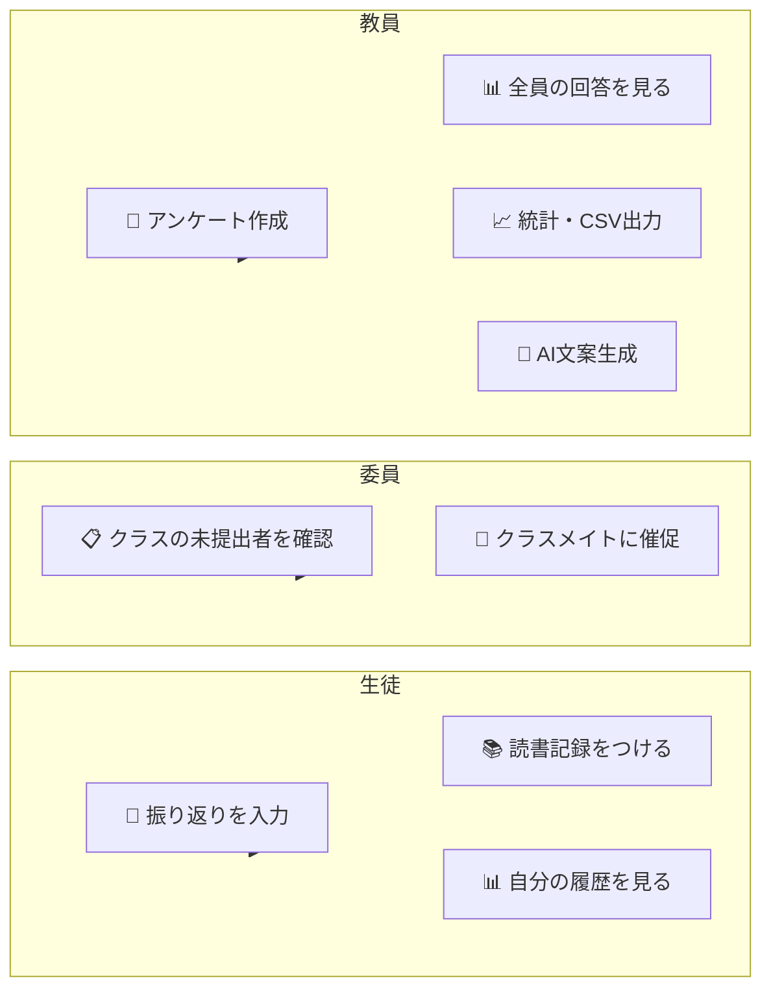
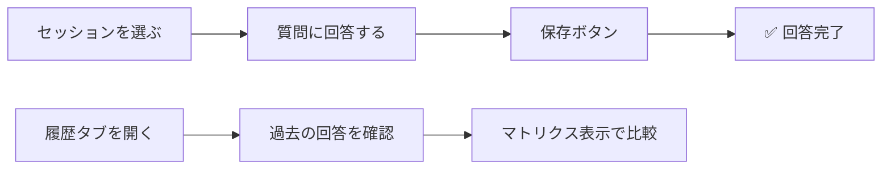
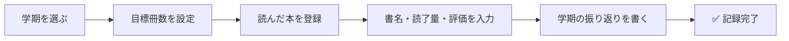
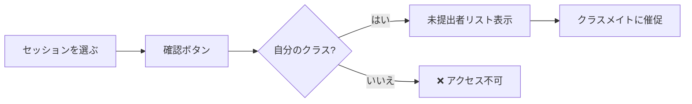
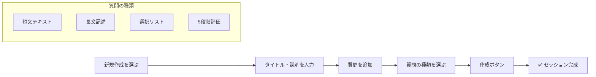
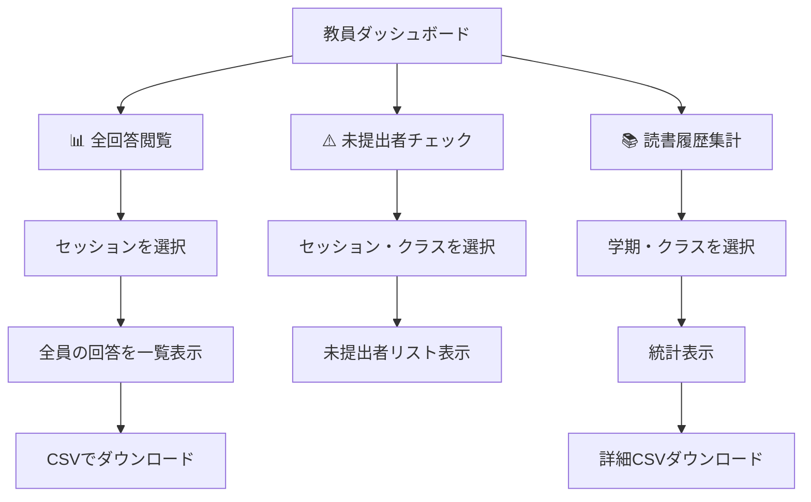
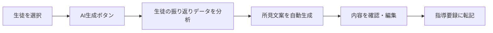
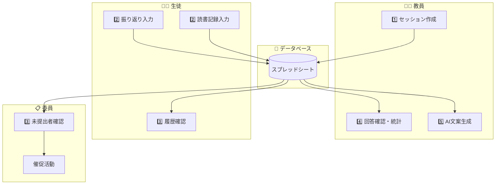

# ManabiFolio システム概要（教員・生徒向け）

## 🌟 ManabiFolioとは？

**ManabiFolio** は、日々の「振り返り」と「読書活動」をデジタル化し、教員の業務効率化と生徒の学びの蓄積を支援するポートフォリオ管理システムです。

Google スプレッドシートをデータベースとして使用するため、特別なサーバー契約などは不要で、使い慣れたGoogleアカウントで安全に運用できます。

---

## 👥 誰が何をできる？

---

## 📱 画面構成

| タブ | 対象 | 主な機能 |
|------|------|----------|
| 📖 振り返りポートフォリオ | 全員 | 振り返り入力・履歴閲覧 |
| 📚 読書履歴調査 | 全員 | 読書記録・目標・振り返り |
| 📋 クラス提出状況（生徒用） | 生徒のみ | 自クラスの未提出者確認 |
| 👨‍🏫 教員ダッシュボード | 教員のみ | 全管理機能 |

---

## 🧑‍🎓 生徒の使い方

### 振り返りポートフォリオ

**できること:**
- 授業や行事の振り返りを入力
- 過去の回答を一覧で確認
- 年間の回答をマトリクス（表）形式で比較

---

### 読書履歴調査

**できること:**
- 学期ごとの読書目標を設定
- 読んだ本を1冊ずつ登録（書名・どれくらい読んだか・感想）
- 学期末に振り返りテキストを記入

---

### クラス提出状況（委員向け）

> ⚠️ **注意**: 自分のクラスの情報しか見られません。他クラスのデータにはアクセスできません。

---

## 🏫 教員の使い方

### アンケート・セッションの作成

---

### 回答データの確認・活用

---

### AI指導要録サポート

---

## 🔄 データの流れ（全体像）

---

## 🔐 誰が何にアクセスできる？

| 機能 | 一般生徒 | 委員 | 教員 |
|------|:--------:|:----:|:----:|
| 自分の振り返り入力 | ✅ | ✅ | ✅ |
| 自分の読書記録入力 | ✅ | ✅ | ✅ |
| 自分の履歴閲覧 | ✅ | ✅ | ✅ |
| 自クラスの未提出者確認 | ❌ | ✅ | ✅ |
| 他クラスの情報閲覧 | ❌ | ❌ | ✅ |
| セッション作成・管理 | ❌ | ❌ | ✅ |
| CSV一括ダウンロード | ❌ | ❌ | ✅ |
| AI指導要録生成 | ❌ | ❌ | ✅ |

---

## 💡 便利な機能

### 🔄 アカウント切替
ヘッダーのメールアドレスをクリックすると、別のGoogleアカウントに簡単に切り替えられます。

### 📱 どの端末でもOK
スマートフォン、タブレット、PC、どの端末からでも同じように使えます。

### 🔒 安全なデータ管理
すべてのデータは学校のGoogle環境内に保存され、外部に流出しません。
（AI生成時のみ匿名化されたテキストがGoogleのAIサービスに送信されます）

---

## ❓ よくある質問

**Q: 他クラスの未提出者は見られますか？**  
A: いいえ。生徒は自分のクラスの情報しか見られません。教員のみ全クラスにアクセスできます。

**Q: 間違って入力した回答は修正できますか？**  
A: はい。同じセッションに再度回答すると、内容が上書きされます。

**Q: 読書記録は削除できますか？**  
A: はい。各記録の横にある削除ボタンで削除できます。

---

## 📅 最終更新: 2026-01-05
