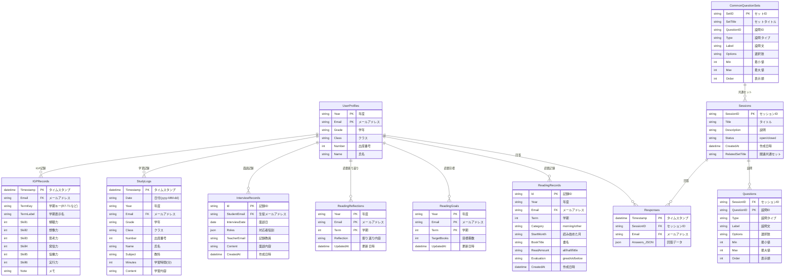

# ManabiFolio データベース仕様書

本ドキュメントでは、ManabiFolioシステムで使用するすべてのスプレッドシート（テーブル）の構造と関係を定義します。

---

## ER図（エンティティ関係図）



---

## 各シートの詳細仕様

### UserProfiles（生徒プロフィール）

生徒の基本情報を管理します。年度ごとにレコードが作成されます。

| カラム | 型 | 必須 | 説明 |
|--------|-----|-----|------|
| Year | string | ✓ | 年度（例: R7年度） |
| Email | string | ✓ | メールアドレス（主キー） |
| Grade | string | ✓ | 学年（1, 2, 3） |
| Class | string | ✓ | クラス（1〜6） |
| Number | int | ✓ | 出席番号 |
| Name | string | ✓ | 氏名 |

---

### Sessions（振り返りセッション）

振り返りアンケートの回を管理します。

| カラム | 型 | 必須 | 説明 |
|--------|-----|-----|------|
| SessionID | string | ✓ | セッションID（例: sess_1234） |
| Title | string | ✓ | タイトル（例: 5月の振り返り） |
| Description | string | | 説明文 |
| Status | string | ✓ | open（受付中）/ closed（終了） |
| CreatedAt | datetime | ✓ | 作成日時 |
| RelatedSetTitle | string | | 関連する共通セットのタイトル |

---

### Questions（設問）

各セッションに紐づく設問を管理します。

| カラム | 型 | 必須 | 説明 |
|--------|-----|-----|------|
| SessionID | string | ✓ | 所属セッションID |
| QuestionID | string | ✓ | 設問ID（例: q_1） |
| Type | string | ✓ | 設問タイプ（text, textarea, radio, checkbox, slider） |
| Label | string | ✓ | 設問文 |
| Options | string | | 選択肢（カンマ区切り） |
| Min | int | | スライダーの最小値 |
| Max | int | | スライダーの最大値 |
| Order | int | ✓ | 表示順 |

---

### Responses（回答）

生徒の振り返り回答を保存します。

| カラム | 型 | 必須 | 説明 |
|--------|-----|-----|------|
| Timestamp | datetime | ✓ | 回答日時 |
| SessionID | string | ✓ | セッションID |
| Email | string | ✓ | 回答者メールアドレス |
| Answers_JSON | json | ✓ | 回答データ（JSON形式） |

**Answers_JSON構造例:**
```json
{
  "q_1": "テキスト回答",
  "q_2": 7,
  "q_3": ["選択肢A", "選択肢B"]
}
```

---

### CommonQuestionSets（共通質問セット）

複数回使い回す設問セットのテンプレートです。

| カラム | 型 | 必須 | 説明 |
|--------|-----|-----|------|
| SetID | string | ✓ | セットID |
| SetTitle | string | ✓ | セットタイトル |
| QuestionID | string | ✓ | 設問ID |
| Type | string | ✓ | 設問タイプ |
| Label | string | ✓ | 設問文 |
| Options | string | | 選択肢 |
| Min | int | | 最小値 |
| Max | int | | 最大値 |
| Order | int | ✓ | 表示順 |

---

### ReadingGoals（読書目標）

各生徒の学期ごとの読書目標を管理します。

| カラム | 型 | 必須 | 説明 |
|--------|-----|-----|------|
| Year | string | ✓ | 年度 |
| Email | string | ✓ | メールアドレス |
| Term | int | ✓ | 学期（1, 2, 3） |
| TargetBooks | int | ✓ | 目標冊数 |
| UpdatedAt | datetime | ✓ | 更新日時 |

---

### ReadingRecords（読書記録）

生徒が読んだ本の記録を管理します。

| カラム | 型 | 必須 | 説明 |
|--------|-----|-----|------|
| Id | string | ✓ | 記録ID（例: rec_20260107_123456_abc） |
| Year | string | ✓ | 年度 |
| Email | string | ✓ | メールアドレス |
| Term | int | ✓ | 学期（1, 2, 3） |
| Category | string | ✓ | 種別（morning: 朝読書, other: その他） |
| StartMonth | string | ✓ | 読み始めた月 |
| BookTitle | string | ✓ | 書名 |
| ReadAmount | string | ✓ | 読んだ量（all: 全部, half: 半分, little: 少し） |
| Evaluation | string | ✓ | 評価（great: 面白い, ok: 普通, below: 普通以下） |
| CreatedAt | datetime | ✓ | 作成日時 |

---

### ReadingReflections（読書振り返り）

各生徒の学期末の読書振り返りコメントを保存します。

| カラム | 型 | 必須 | 説明 |
|--------|-----|-----|------|
| Year | string | ✓ | 年度 |
| Email | string | ✓ | メールアドレス |
| Term | int | ✓ | 学期 |
| Reflection | string | ✓ | 振り返り内容 |
| UpdatedAt | datetime | ✓ | 更新日時 |

---

### InterviewRecords（面談記録）【新規】

教員が生徒と行った面談の記録を管理します。年度を跨いで参照可能です。

| カラム | 型 | 必須 | 説明 |
|--------|-----|-----|------|
| Id | string | ✓ | 記録ID（例: int_20260107_123456_xyz） |
| StudentEmail | string | ✓ | 生徒メールアドレス |
| InterviewDate | date | ✓ | 面談日 |
| Roles | json | ✓ | 対応者の役割（JSON配列） |
| TeacherEmail | string | ✓ | 記録した教員のメールアドレス |
| Content | string | ✓ | 面談内容 |
| CreatedAt | datetime | ✓ | 作成日時 |

**Roles構造例:**
```json
["homeroom", "grade_teacher"]
```

| 役割コード | 表示名 |
|-----------|--------|
| homeroom | 担任 |
| assistant | 副担任 |
| grade_chief | 学年主任 |
| grade_teacher | 学年教員 |
| club_advisor | 部活動顧問 |
| other | その他 |

---

### StudyLogs（学習記録）

生徒が日々の学習時間を教科別に記録します。

| カラム | 型 | 必須 | 説明 |
|--------|-----|-----|------|
| Timestamp | datetime | ✓ | 記録日時 |
| Date | string | ✓ | 日付（yyyy-MM-dd） |
| Year | string | ✓ | 年度（例: R7年度） |
| Email | string | ✓ | メールアドレス |
| Grade | string | ✓ | 学年 |
| Class | string | ✓ | クラス |
| Number | int | ✓ | 出席番号 |
| Name | string | ✓ | 氏名 |
| Subject | string | ✓ | 教科（国語/数学/理科/社会/英語） |
| Minutes | int | ✓ | 学習時間（分） |
| Content | string | | 学習内容 |

---

### IGPRecords（IGP記録）

IGPの6つの力を学期ごとに1〜5で記録します。年度に依存せず参照可能です。

| カラム | 型 | 必須 | 説明 |
|--------|-----|-----|------|
| Timestamp | datetime | ✓ | 記録日時 |
| Email | string | ✓ | メールアドレス |
| TermKey | string | ✓ | 学期キー（例: R7-T1） |
| TermLabel | string | ✓ | 学期表示名（例: R7 1学期） |
| Skill1 | int | ✓ | 傾聴力（1〜5） |
| Skill2 | int | ✓ | 想像力（1〜5） |
| Skill3 | int | ✓ | 思考力（1〜5） |
| Skill4 | int | ✓ | 発信力（1〜5） |
| Skill5 | int | ✓ | 協働力（1〜5） |
| Skill6 | int | ✓ | 実行力（1〜5） |
| Note | string | | メモ |

---

## キューシート（高負荷時の一時保存）

詳細は [system_dataflow.md](./system_dataflow.md) を参照

| シート名 | 用途 |
|---------|------|
| ResponseQueue | 振り返り回答の一時保存 |
| ReadingRecordQueue | 読書記録の一時保存 |

---

## データ保持ポリシー

| データ種別 | 保持期間 | 備考 |
|-----------|---------|------|
| UserProfiles | 永久 | 年度ごとにレコード作成 |
| Sessions/Questions | 永久 | |
| Responses | 永久 | |
| ReadingRecords | 永久 | |
| InterviewRecords | 永久 | 年度を跨いで参照可能 |
| StudyLogs | 永久 | 年度ごとに参照 |
| IGPRecords | 永久 | 年度を跨いで参照可能 |
| キューシート | 1週間 | 処理済みは自動削除 |
| バックアップ | 30日推奨 | 手動管理 |
