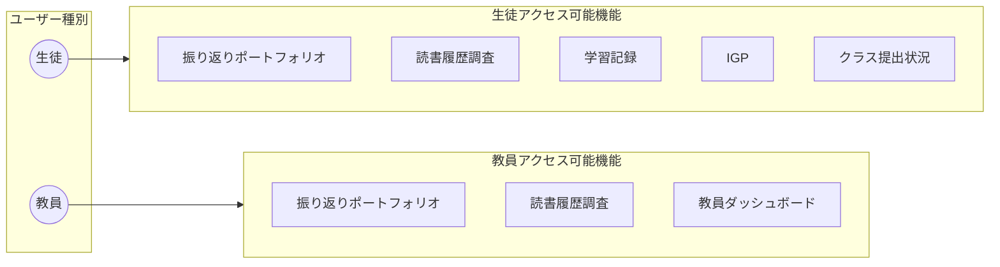
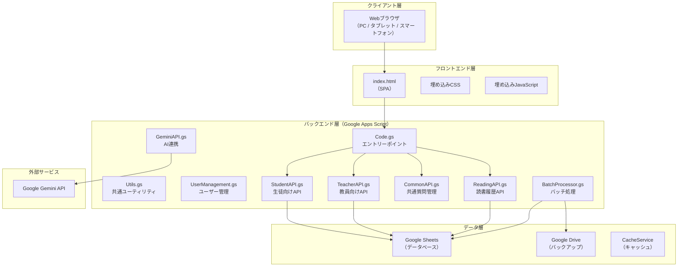
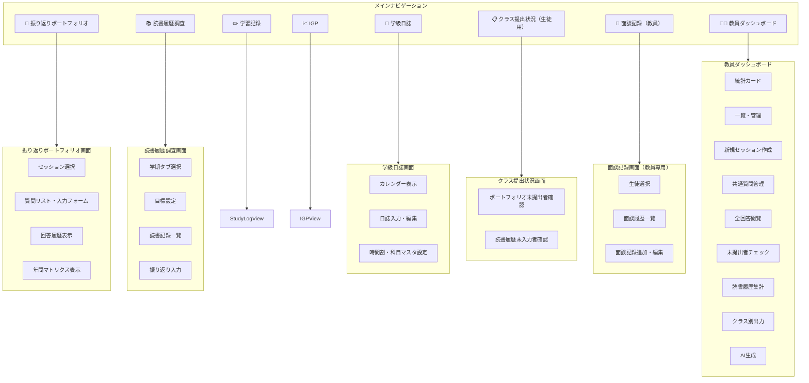
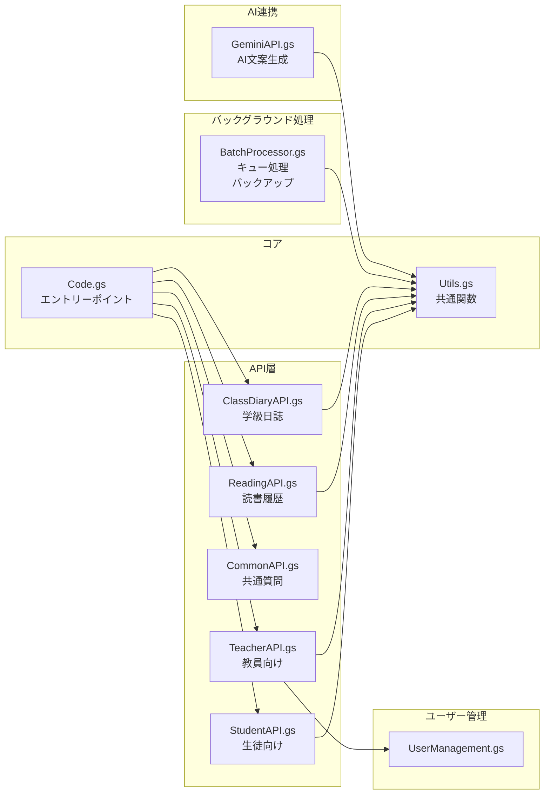
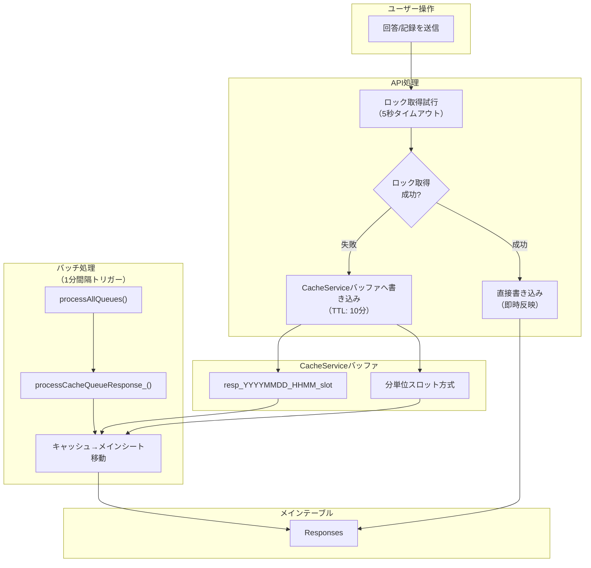
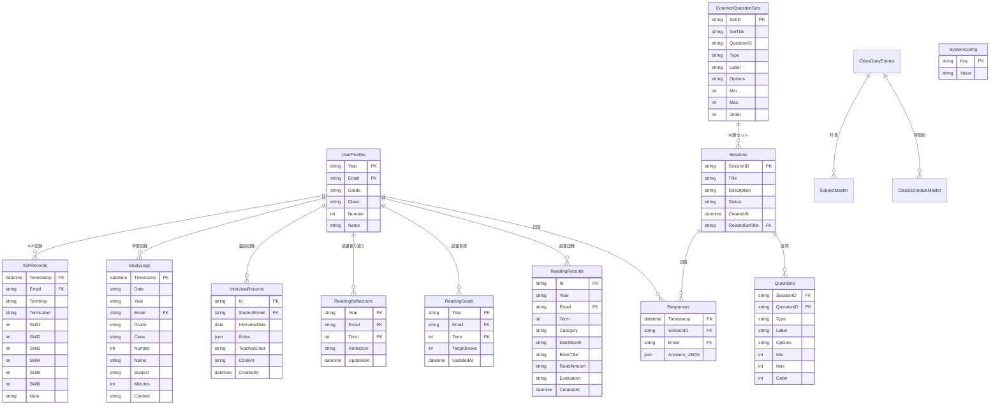
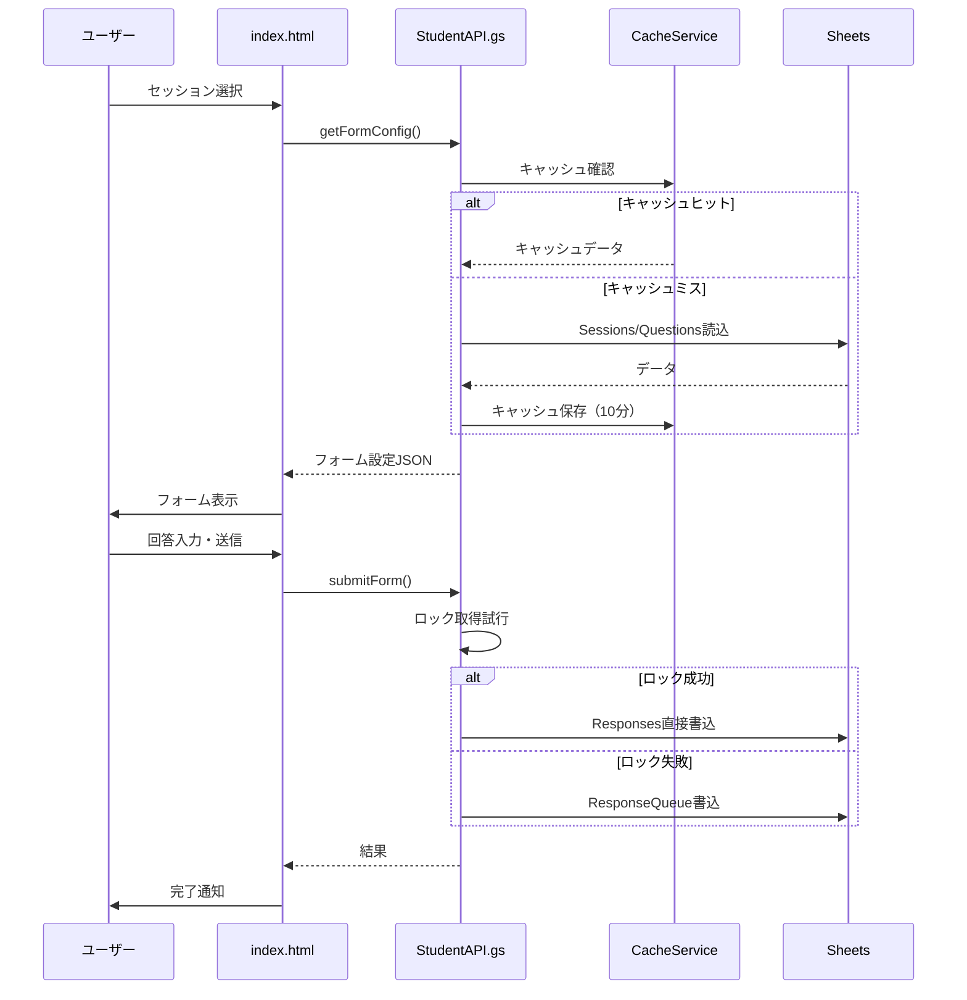
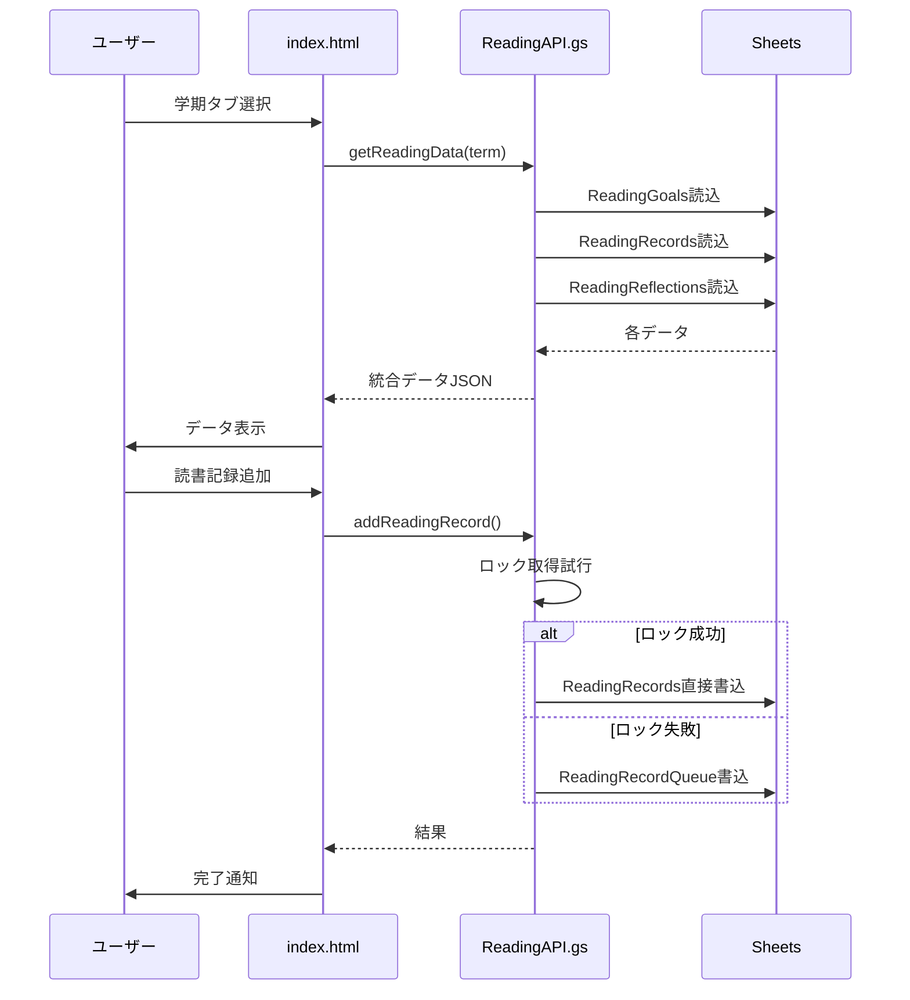
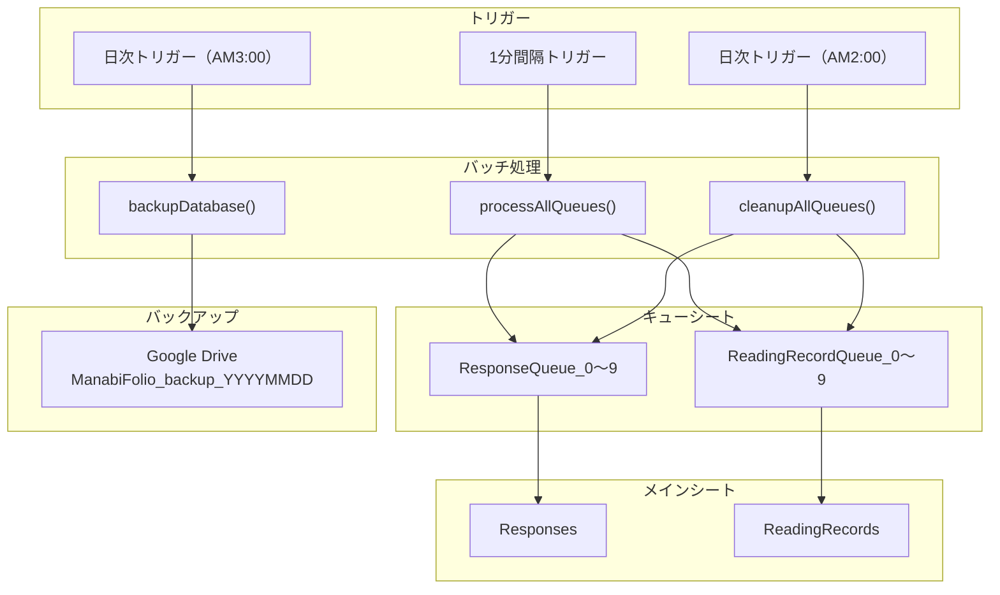
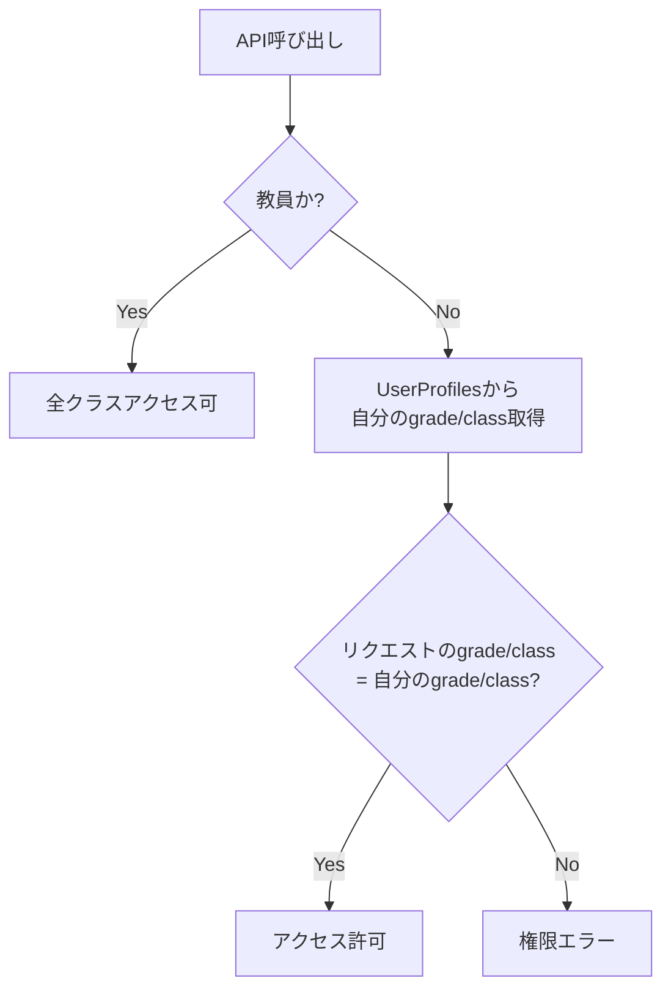

# ManabiFolio システム包括資料

## 目次
1. [システム概要](#システム概要)
2. [システムアーキテクチャ](#システムアーキテクチャ)
3. [フロントエンド](#フロントエンド)
4. [バックエンド](#バックエンド)
5. [データベース構造（ER図・テーブル仕様）](#データベース構造)
6. [データフロー図](#データフロー図)
7. [API一覧](#api一覧)

---

## システム概要

**ManabiFolio** は、Google Apps Script (GAS) と Google Sheets をベースとした学校向けポートフォリオ管理システムです。

### 主要機能

| 機能 | 説明 | 対象ユーザー |
|------|------|-------------|
| **振り返りポートフォリオ** | 生徒が各セッションの振り返りを入力・閲覧 | 全ユーザー |
| **読書履歴調査** | 学期ごとの読書記録・目標・振り返りを管理 | 全ユーザー |
| **学習記録** | 教科別の学習時間・内容を記録 | 全ユーザー |
| **IGP** | 6つの力を学期ごとに自己評価 | 全ユーザー |
| **学級日誌** | クラスごとの日誌・出欠・時間割管理 | 全ユーザー |
| **クラス提出状況（生徒用）** | 委員が自クラスの未提出者を確認・催促 | 生徒（委員） |
| **面談記録** | 生徒ごとの面談履歴管理 | 教員のみ |
| **教員ダッシュボード** | 統計、一覧管理、集計、CSV出力、AI文案生成等 | 教員のみ |

### ユーザー種別と権限



---

## システムアーキテクチャ

### 全体構成図



### 技術スタック

| 層 | 技術 | 詳細 |
|---|------|------|
| フロントエンド | HTML5 / CSS3 / JavaScript | SPAとして`index.html`に統合 |
| バックエンド | Google Apps Script | `google.script.run`でAPI呼び出し |
| データベース | Google Sheets | 10シート構成 |
| キャッシュ | CacheService | 10分キャッシュ（フォーム設定）、CacheServiceバッファ方式採用 |
| 外部連携 | Google Gemini API | AI指導要録生成 |
| バックアップ | Google Drive | 日次バックアップ |

---

## フロントエンド

### ファイル構成

```
portfolio_prototype/
└── index.html    # フロントエンドUI（SPA）
                  # HTML + CSS + JavaScript が1ファイルに統合
```

### 画面構成



### 主要UI機能

| 画面 | 機能 | 使用API |
|------|------|---------|
| **振り返りポートフォリオ** | セッション選択・回答入力 | `getFormConfig()`, `submitForm()` |
| | 回答履歴閲覧 | `getUserHistory()` |
| | 年間マトリクス表示 | `getMyAnnualResponses()` |
| **読書履歴調査** | 目標設定・記録追加/削除 | `getReadingData()`, `setReadingGoal()`, `addReadingRecord()` |
| | 振り返り入力 | `setReadingReflection()` |
| **クラス提出状況** | 未提出者/未記録者確認 | `getSubmissionStatus()`, `getReadingMissingStudents()` |
| **教員ダッシュボード** | 統計表示・セッション管理 | `getDashboardStats()`, `createSession()`, `toggleSessionStatus()` |
| | AI文案生成 | `generateAiGuidance()` |

### レスポンシブ対応

- PC / タブレット / スマートフォンに対応
- メディアクエリによるレイアウト調整
- 教員ダッシュボードのマトリクス表示は横スクロール対応

---

## バックエンド

### ファイル構成と役割



### 各ファイルの詳細

| ファイル | 行数 | 主要関数 | 役割 |
|---------|------|---------|------|
| **Code.gs** | 478 | `doGet()`, `getScriptUrl()`, `writeToCacheQueue_()` | Webアプリのエントリーポイント、HTML配信、CacheServiceバッファ |
| **Utils.gs** | 72 | `getTargetSpreadsheet()`, `getUserInfo()`, `parseJSONSafe_()` | 共通ユーティリティ関数 |
| **UserManagement.gs** | 252 | `setupSheets()`, `registerUserProfile()`, `getSystemYear()` | ユーザー管理、シート初期化、年度管理 |
| **StudentAPI.gs** | 199 | `getFormConfig()`, `submitForm()`, `getUserHistory()`, `getMyAnnualResponses()` | 生徒向けAPI（回答送信・履歴取得） |
| **TeacherAPI.gs** | 454 | `createSession()`, `getTeacherAllResponses()`, `getSubmissionStatus()`, `getDashboardStats()` | 教員向けAPI（セッション管理・統計） |
| **CommonAPI.gs** | 114 | `getCommonQuestionSets()`, `saveCommonQuestionSet()`, `deleteCommonQuestionSet()` | 共通質問セット管理 |
| **ReadingAPI.gs** | 609 | `getReadingData()`, `setReadingGoal()`, `addReadingRecord()`, `getReadingStats()` | 読書履歴管理API |
| **ClassDiaryAPI.gs** | 498 | `getDiaryEntry()`, `saveDiaryEntry()`, `getScheduleMaster()`, `getSubjectMaster()` | 学級日誌管理（日誌・時間割・科目マスタ） |
| **InterviewAPI.gs** | 234 | `getStudentInterviews()`, `addInterviewRecord()`, `getInterviewSummaryByClass()` | 面談記録管理（教員専用） |
| **BatchProcessor.gs** | 756 | `processAllQueues()`, `processCacheQueueResponse_()`, `backupDatabase()`, `flushFormConfigCache()` | キュー処理（CacheService対応）、バックアップ、キャッシュ管理 |
| **GeminiAPI.gs** | 370 | `generateAiGuidance()`, `generateAiDataCSV()` | AI指導要録生成（Gemini連携） |
| **DemoData.gs** | 258 | `createDummyData()`, `deleteDummyData()` | ダミーデータ作成・削除 |
| **Tests.gs** | 554 | `runAllTests()`, `runLoadTest()` | 自動テスト・負荷テスト |

### キュー処理システム

高負荷時のデータ整合性を保つため、**CacheServiceバッファ方式**による非同期処理を実装しています。



### トリガー設定

| トリガー種別 | 関数 | 実行間隔 | 目的 |
|-------------|------|---------|------|
| 時間主導型 | `processAllQueues()` | 1分ごと | キューの処理 |
| 時間主導型 | `backupDatabase()` | 毎日AM3:00 | データバックアップ |
| 時間主導型 | `cleanupAllQueues()` | 毎日AM2:00 | 古いキューデータの削除 |

---

## データベース構造

### ER図（エンティティ関係図）



### テーブル一覧と詳細仕様

#### 1. UserProfiles（生徒プロフィール）

生徒の基本情報を管理。年度ごとにレコードが作成されます。

| カラム | 型 | 必須 | 説明 |
|--------|-----|-----|------|
| Year | string | ✓ | 年度（例: R7年度） |
| Email | string | ✓ | メールアドレス（主キー） |
| Grade | string | ✓ | 学年（1, 2, 3） |
| Class | string | ✓ | クラス（1〜6） |
| Number | int | ✓ | 出席番号 |
| Name | string | ✓ | 氏名 |

---

#### 2. Sessions（振り返りセッション）

振り返りアンケートの回を管理。

| カラム | 型 | 必須 | 説明 |
|--------|-----|-----|------|
| SessionID | string | ✓ | セッションID（例: sess_1234） |
| Title | string | ✓ | タイトル（例: 5月の振り返り） |
| Description | string | | 説明文 |
| Status | string | ✓ | open（受付中）/ closed（終了） |
| CreatedAt | datetime | ✓ | 作成日時 |
| RelatedSetTitle | string | | 関連する共通セットのタイトル |

---

#### 3. Questions（設問）

各セッションに紐づく設問を管理。

| カラム | 型 | 必須 | 説明 |
|--------|-----|-----|------|
| SessionID | string | ✓ | 所属セッションID |
| QuestionID | string | ✓ | 設問ID（例: q_1） |
| Type | string | ✓ | 設問タイプ |
| Label | string | ✓ | 設問文 |
| Options | string | | 選択肢（カンマ区切り） |
| Min | int | | スライダーの最小値 |
| Max | int | | スライダーの最大値 |
| Order | int | ✓ | 表示順 |

**設問タイプ一覧:**
| タイプ | 説明 |
|--------|------|
| `text` | 1行テキスト入力 |
| `textarea` | 複数行テキスト入力 |
| `radio` | ラジオボタン（単一選択） |
| `checkbox` | チェックボックス（複数選択） |
| `slider` | スライダー（数値入力） |

---

#### 4. Responses（回答）

生徒の振り返り回答を保存。

| カラム | 型 | 必須 | 説明 |
|--------|-----|-----|------|
| Timestamp | datetime | ✓ | 回答日時 |
| SessionID | string | ✓ | セッションID |
| Email | string | ✓ | 回答者メールアドレス |
| Answers_JSON | json | ✓ | 回答データ（JSON形式） |

**Answers_JSON構造例:**
```json
{
  "q_1": "テキスト回答",
  "q_2": 7,
  "q_3": ["選択肢A", "選択肢B"]
}
```

---

#### 5. CommonQuestionSets（共通質問セット）

複数回使い回す設問セットのテンプレート。

| カラム | 型 | 必須 | 説明 |
|--------|-----|-----|------|
| SetID | string | ✓ | セットID |
| SetTitle | string | ✓ | セットタイトル |
| QuestionID | string | ✓ | 設問ID |
| Type | string | ✓ | 設問タイプ |
| Label | string | ✓ | 設問文 |
| Options | string | | 選択肢 |
| Min | int | | 最小値 |
| Max | int | | 最大値 |
| Order | int | ✓ | 表示順 |

---

#### 6. ReadingGoals（読書目標）

各生徒の学期ごとの読書目標を管理。

| カラム | 型 | 必須 | 説明 |
|--------|-----|-----|------|
| Year | string | ✓ | 年度 |
| Email | string | ✓ | メールアドレス |
| Term | int | ✓ | 学期（1, 2, 3） |
| TargetBooks | int | ✓ | 目標冊数 |
| UpdatedAt | datetime | ✓ | 更新日時 |

---

#### 7. ReadingRecords（読書記録）

生徒が読んだ本の記録を管理。

| カラム | 型 | 必須 | 説明 |
|--------|-----|-----|------|
| Id | string | ✓ | 記録ID |
| Year | string | ✓ | 年度 |
| Email | string | ✓ | メールアドレス |
| Term | int | ✓ | 学期（1, 2, 3） |
| Category | string | ✓ | 種別 |
| StartMonth | string | ✓ | 読み始めた月 |
| BookTitle | string | ✓ | 書名 |
| ReadAmount | string | ✓ | 読んだ量 |
| Evaluation | string | ✓ | 評価 |
| CreatedAt | datetime | ✓ | 作成日時 |

**Categoryの値:**
| 値 | 説明 |
|---|------|
| `morning` | 朝読書 |
| `other` | その他 |

**ReadAmountの値:**
| 値 | 説明 |
|---|------|
| `all` | 全部読んだ |
| `half` | 半分くらい |
| `little` | 少しだけ |

**Evaluationの値:**
| 値 | 説明 |
|---|------|
| `great` | 面白い |
| `ok` | 普通 |
| `below` | 普通以下 |

---

#### 8. ReadingReflections（読書振り返り）

各生徒の学期末の読書振り返りコメント。

| カラム | 型 | 必須 | 説明 |
|--------|-----|-----|------|
| Year | string | ✓ | 年度 |
| Email | string | ✓ | メールアドレス |
| Term | int | ✓ | 学期 |
| Reflection | string | ✓ | 振り返り内容 |
| UpdatedAt | datetime | ✓ | 更新日時 |

---

#### 9. InterviewRecords（面談記録）

教員が生徒と行った面談の記録。年度を跨いで参照可能。

| カラム | 型 | 必須 | 説明 |
|--------|-----|-----|------|
| Id | string | ✓ | 記録ID |
| StudentEmail | string | ✓ | 生徒メールアドレス |
| InterviewDate | date | ✓ | 面談日 |
| Roles | json | ✓ | 対応者の役割（JSON配列） |
| TeacherEmail | string | ✓ | 記録した教員のメールアドレス |
| Content | string | ✓ | 面談内容 |
| CreatedAt | datetime | ✓ | 作成日時 |

**Rolesの値:**
| 役割コード | 表示名 |
|-----------|--------|
| `homeroom` | 担任 |
| `assistant` | 副担任 |
| `grade_chief` | 学年主任 |
| `grade_teacher` | 学年教員 |
| `club_advisor` | 部活動顧問 |
| `other` | その他 |

---

#### 10. SystemConfig（システム設定）

システム全体の設定値を管理。

| カラム | 型 | 必須 | 説明 |
|--------|-----|-----|------|
| Key | string | ✓ | 設定キー |
| Value | string | ✓ | 設定値 |

**主要な設定キー:**
| Key | 説明 | 例 |
|-----|------|-----|
| `systemYear` | 現在のシステム年度 | `R7年度` |

---

#### 11. ClassDiaryEntries（学級日誌エントリ）

各クラス・各日の日誌データを管理。

| カラム | 型 | 必須 | 説明 |
|--------|-----|-----|------|
| Grade | string | ✓ | 学年 |
| Class | string | ✓ | クラス |
| Date | date | ✓ | 日付 |
| Weather | string | | 天気 |
| DayDutyStudents | json | | 日直生徒（JSON配列） |
| Attendance | json | | 出欠データ（JSON） |
| Schedules | json | | 時間割データ（JSON配列） |
| DayReflection | string | | 一日の振り返り |
| Notes | string | | 連絡事項 |
| UpdatedAt | datetime | ✓ | 更新日時 |

---

#### 12. ClassScheduleMaster（曜日別時間割マスタ）

クラスごとの曜日別デフォルト時間割を管理。

| カラム | 型 | 必須 | 説明 |
|--------|-----|-----|------|
| Grade | string | ✓ | 学年 |
| Class | string | ✓ | クラス |
| DayOfWeek | int | ✓ | 曜日（1=月〜5=金） |
| Period | int | ✓ | 時限 |
| Subject | string | | 科目名 |
| UpdatedAt | datetime | ✓ | 更新日時 |

---

#### 13. SubjectMaster（科目マスタ）

クラスごとの科目リストを管理。

| カラム | 型 | 必須 | 説明 |
|--------|-----|-----|------|
| Grade | string | ✓ | 学年 |
| Class | string | ✓ | クラス |
| SubjectName | string | ✓ | 科目名 |
| DisplayOrder | int | | 表示順 |
| UpdatedAt | datetime | ✓ | 更新日時 |


---

### キューシート（高負荷時の一時保存）

#### ResponseQueue_0〜9（振り返り回答キュー）

| カラム | 説明 |
|--------|------|
| Timestamp | 回答タイムスタンプ |
| SessionID | セッションID |
| Email | ユーザーメールアドレス |
| Answers_JSON | 回答データ（JSON形式） |
| Status | pending / processed |
| QueuedAt | キュー追加日時 |

#### ReadingRecordQueue_0〜9（読書記録キュー）

| カラム | 説明 |
|--------|------|
| Term | 学期 |
| Category | 種別（朝読書/その他） |
| StartMonth | 読み始めた月 |
| BookTitle | 書籍タイトル |
| ReadAmount | 読んだ量 |
| Evaluation | 評価 |
| Email | ユーザーメールアドレス |
| Status | pending / processed |
| QueuedAt | キュー追加日時 |

---

## データフロー図

### 振り返りポートフォリオのデータフロー



### 読書履歴調査のデータフロー



### バックグラウンド処理のデータフロー



---

## API一覧

### Code.gs

| 関数 | 用途 |
|------|------|
| `doGet()` | Webアプリエントリーポイント |
| `getScriptUrl()` | WebアプリURL取得（アカウント切替用） |

---

### Utils.gs

| 関数 | 用途 |
|------|------|
| `getTargetSpreadsheet()` | データ格納用スプレッドシート取得 |
| `getUserInfo()` | 現在ユーザー情報取得（email, isTeacher） |

---

### UserManagement.gs

| 関数 | 用途 |
|------|------|
| `setupSheets()` | 全シート初期化 |
| `resetAllData(confirmation)` | データ完全削除 |
| `getSystemYear()` | システム年度取得 |
| `setSystemYear(year)` | システム年度設定 |
| `checkUserRegistration(email)` | ユーザー登録確認 |
| `registerUserProfile(...)` | ユーザー登録 |
| `getClassUserList(grade, cls)` | クラス名簿取得 |
| `updateUserProfile(...)` | ユーザープロフィール更新 |

---

### StudentAPI.gs

| 関数 | 用途 | フロントエンド |
|------|------|----------------|
| `getFormConfig(includeClosed)` | 回答フォーム設定取得 | 初期ロード |
| `getUserHistory(targetEmail)` | 回答履歴取得 | 履歴表示 |
| `submitForm(sessionId, formJson, targetEmail)` | 回答送信 | 回答保存 |
| `getMyAnnualResponses(setTitle)` | 年間回答取得 | マトリクス表示 |
| `getMyStudyLogs(targetEmail)` | 学習記録取得 | 学習記録タブ |
| `getStudyLogsByDate(dateStr, targetEmail)` | 日付指定の学習記録取得 | 学習記録タブ |
| `submitStudyLogs(dateStr, entries, content, targetEmail)` | 学習記録保存 | 学習記録タブ |
| `saveIgpRecord(termKey, termLabel, scores, note, targetEmail)` | IGP保存 | IGPタブ |
| `getIgpRecords(targetEmail)` | IGP履歴取得 | IGPタブ/教員IGP |
| `getIgpCompare(termKeyA, termKeyB, targetEmail)` | IGP比較取得 | IGPタブ |

---

### TeacherAPI.gs

| 関数 | 用途 | フロントエンド |
|------|------|----------------|
| `getTeacherAllResponses(sessionId)` | セッション回答一覧 | 全回答閲覧 |
| `createSession(title, desc, questionsJson, relatedSetTitle)` | セッション作成 | 新規作成 |
| `toggleSessionStatus(sessionId, newStatus)` | 公開/終了切替 | 一覧管理 |
| `getAnnualResponses(targetSetTitle)` | 年間回答取得（教員用） | 集計 |
| `getTeacherClassData(targetId, grade, cls)` | クラス別データ | クラス別出力 |
| `getSubmissionStatus(sessionId, grade, cls)` | 提出状況 | 未提出者チェック |
| `getDashboardStats()` | 統計カード | ダッシュボード |
| `getExportTargetList()` | 出力対象リスト | クラス別出力 |

---

### CommonAPI.gs

| 関数 | 用途 |
|------|------|
| `getCommonQuestionSets()` | 共通質問セット一覧取得 |
| `saveCommonQuestionSet(setId, setTitle, jsonQuestions)` | 共通質問セット保存 |
| `deleteCommonQuestionSet(setId)` | 共通質問セット削除 |

---

### ReadingAPI.gs

| 関数 | 用途 | フロントエンド |
|------|------|----------------|
| `getReadingData(term, targetEmail)` | 読書データ取得 | 読書履歴タブ |
| `setReadingGoal(term, targetBooks, targetEmail)` | 目標設定 | 目標保存 |
| `addReadingRecord(...)` | 読書記録追加 | 記録追加 |
| `deleteReadingRecord(recordId, targetEmail)` | 読書記録削除 | 記録削除 |
| `updateReadingRecord(...)` | 読書記録更新 | 記録編集 |
| `setReadingReflection(term, reflectionText, targetEmail)` | 振り返り保存 | 振り返り入力 |
| `getReadingStats(term, grade, cls)` | 読書統計 | 教員集計 |
| `getReadingMissingStudents(term, grade, cls)` | 未入力者 | 未入力者チェック |

---

### ClassDiaryAPI.gs

| 関数 | 用途 | フロントエンド |
|------|------|----------------|
| `getDiaryEntry(grade, cls, dateStr)` | 指定日の日誌取得 | 日誌表示 |
| `saveDiaryEntry(grade, cls, dateStr, data)` | 日誌保存 | 日誌入力 |
| `getMonthDiaries(grade, cls, yearNum, month)` | 月間日誌一覧 | カレンダー |
| `getScheduleMaster(grade, cls)` | 曜日別時間割マスタ取得 | 時間割設定 |
| `saveScheduleMaster(grade, cls, dayOfWeek, schedules)` | 時間割マスタ保存 | 時間割設定 |
| `getSubjectMaster(grade, cls)` | 科目マスタ取得 | 科目設定 |
| `saveSubjectMaster(grade, cls, subjects)` | 科目マスタ保存 | 科目設定 |
| `getClassRoster(grade, cls)` | クラス名簿取得 | 出欠入力 |

---

### InterviewAPI.gs

| 関数 | 用途 | フロントエンド |
|------|------|----------------|
| `getStudentInterviews(studentEmail)` | 生徒の面談記録取得 | 面談履歴表示 |
| `getInterviewSummaryByClass(grade, cls)` | クラス別面談記録一覧 | 生徒選択 |
| `addInterviewRecord(studentEmail, date, roles, content)` | 面談記録追加 | 記録追加 |
| `updateInterviewRecord(recordId, date, roles, content)` | 面談記録更新 | 記録編集 |
| `deleteInterviewRecord(recordId)` | 面談記録削除 | 記録削除 |
| `getInterviewRoleOptions()` | 対応者役割リスト取得 | 役割選択 |

---

### BatchProcessor.gs

| 関数 | 用途 |
|------|------|
| `processAllQueues()` | 全キュー処理（トリガー用） |
| `processResponseQueue_()` | 振り返りキュー処理 |
| `processReadingRecordQueue_()` | 読書記録キュー処理 |
| `cleanupProcessedQueue_()` | 処理済みデータ削除 |
| `cleanupAllQueues()` | 全キュークリーンアップ |
| `backupDatabase()` | DBバックアップ作成 |
| `flushFormConfigCache()` | フォーム設定キャッシュクリア |
| `initializeShardQueues()` | シャードキュー初期作成 |
| `getQueueStatus()` | キュー状態確認（デバッグ用） |

---

### GeminiAPI.gs

| 関数 | 用途 |
|------|------|
| `getAllStudentEmails()` | 全生徒メール取得 |
| `generateAiGuidance(targetEmail)` | AI指導要録生成 |
| `generateAiDataCSV(grade, cls)` | クラス単位AI用CSV生成 |
| `generateSingleStudentCSV(email)` | 個別生徒AI用CSV生成 |

---

## 権限チェックのロジック

### 生徒によるクラス提出状況閲覧



---

## 設定プロパティ

システムで使用するスクリプトプロパティ:

| プロパティ名 | 説明 | 例 |
|-------------|------|-----|
| `SPREADSHEET_ID` | データベーススプレッドシートID | `<your-spreadsheet-id>` |
| `TEACHER_DOMAIN` | 教員メールドメイン | `@teacher.example.ed.jp` |
| `STUDENT_DOMAIN` | 生徒メールドメイン（カンマ区切りで複数可） | `@student.example.ed.jp,@demo.manabifolio.local` |
| `BACKUP_FOLDER_ID` | バックアップ先DriveフォルダID | `<backup-folder-id>` |
| `GEMINI_API_KEY` | Gemini APIキー | `<your-gemini-api-key>` |
| `DB_RESET_KEY` | DB初期化用リセットキー | `<strong-reset-key>` |
| `DEBUG_ENTRY` | デバッグモード有効化 | `true` |

---

## データ保持ポリシー

| データ種別 | 保持期間 | 備考 |
|-----------|---------|------|
| UserProfiles | 永久 | 年度ごとにレコード作成 |
| Sessions/Questions | 永久 | |
| Responses | 永久 | |
| ReadingRecords | 永久 | |
| ReadingReflections | 永久 | |
| InterviewRecords | 永久 | 年度を跨いで参照可能 |
| StudyLogs | 永久 | 年度ごとに参照 |
| IGPRecords | 永久 | 年度を跨いで参照可能 |
| キューシート | 1週間 | 処理済みは自動削除 |
| バックアップ | 30日推奨 | 手動管理 |

---

## 最終更新

2026-01-09
