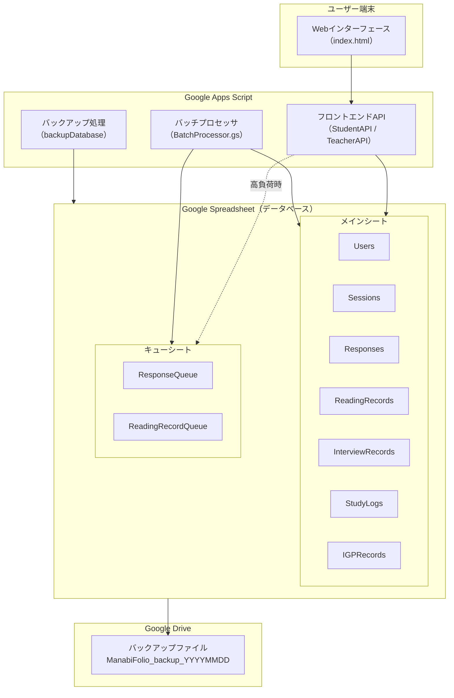
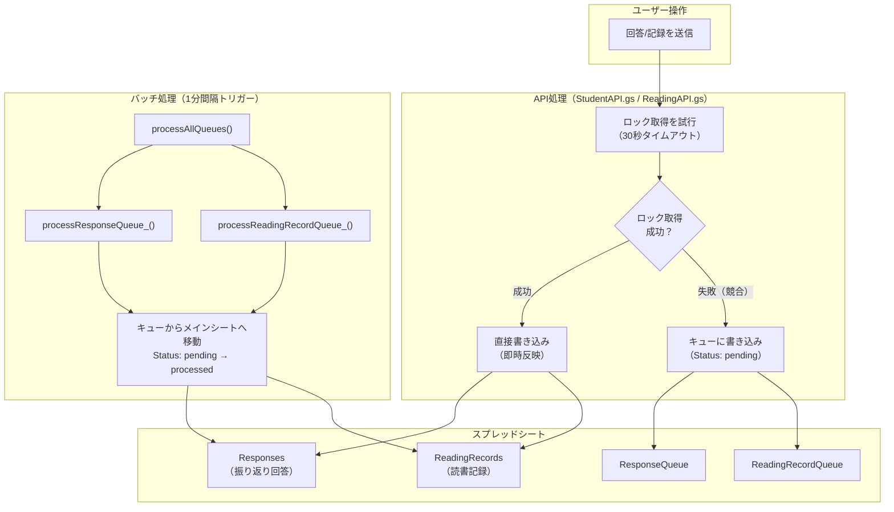
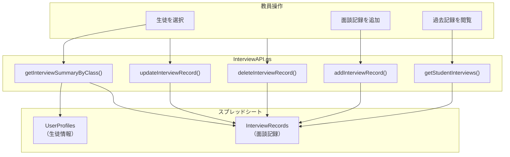
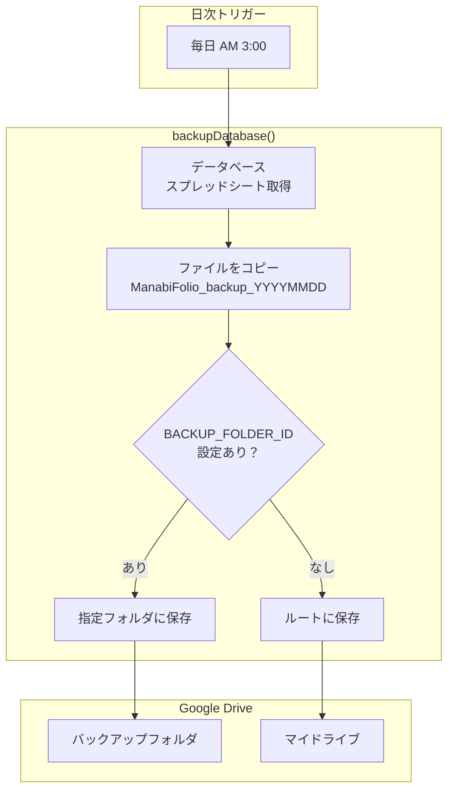
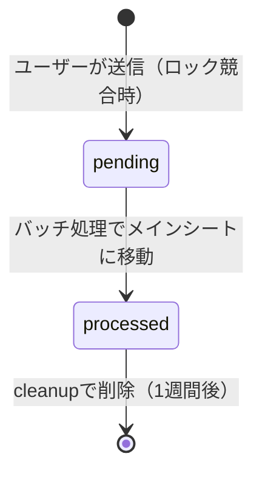
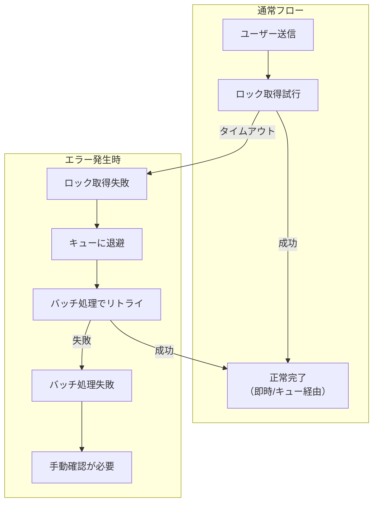

# ManabiFolio システムデータフロー図

本ドキュメントでは、ManabiFolioシステムのバックグラウンド処理（キューイング・バックアップ）を含むデータフローを図解します。

---

## システム全体のデータフロー

---

## 関連ドキュメント

- **DB仕様書**: [database_schema.md](./database_schema.md) - 全シートのカラム定義とER図

---

## キューイングシステムの詳細フロー

---

## 面談記録のデータフロー【新機能】

### InterviewRecordsシートの構造

| カラム | 型 | 説明 |
|--------|-----|------|
| Id | string | 記録ID（int_YYYYMMDD_HHMMSS_xxx） |
| StudentEmail | string | 生徒メールアドレス |
| InterviewDate | date | 面談日 |
| Roles | json | 対応者役割（JSON配列） |
| TeacherEmail | string | 記録教員 |
| Content | string | 面談内容 |
| CreatedAt | datetime | 作成日時 |

> **Note**: 年度情報を持たないため、年度を跨いでも同一生徒の記録を参照可能

---

## キューシートの構造

### ResponseQueue（振り返り回答キュー）

| カラム | 説明 |
|--------|------|
| Timestamp | 回答タイムスタンプ |
| SessionID | セッションID |
| Email | ユーザーメールアドレス |
| Answers_JSON | 回答データ（JSON形式） |
| Status | pending / processed |
| QueuedAt | キュー追加日時 |

### ReadingRecordQueue（読書記録キュー）

| カラム | 説明 |
|--------|------|
| Term | 学期 |
| Type | 種別（朝読書/その他） |
| Month | 読み始めた月 |
| Title | 書籍タイトル |
| Amount | 読んだ量 |
| Rating | 評価 |
| Email | ユーザーメールアドレス |
| Status | pending / processed |
| QueuedAt | キュー追加日時 |

---

## バックアップシステムの詳細フロー

---

## トリガー設定一覧

| トリガー | 関数 | 実行間隔 | 目的 |
|---------|------|---------|------|
| 時間主導型 | `processAllQueues()` | 1分ごと | キューの処理 |
| 時間主導型 | `backupDatabase()` | 毎日AM3:00 | データバックアップ |
| 時間主導型 | `cleanupProcessedQueue_()` | 週1回（任意） | 古いキューデータの削除 |

---

## キュー処理の状態遷移

---

## エラー発生時のフロー

---

## 設定プロパティ

キューイング・バックアップシステムで使用するスクリプトプロパティ：

| プロパティ名 | 説明 | 例 |
|-------------|------|-----|
| `SPREADSHEET_ID` | データベーススプレッドシートID | `<your-spreadsheet-id>` |
| `BACKUP_FOLDER_ID` | バックアップ先DriveフォルダID | `<backup-folder-id>` |

---

## 定数設定

| 定数名 | 値 | 説明 |
|--------|-----|------|
| `QUEUE_LOCK_WAIT_MS` | 30000 | ロック取得タイムアウト（30秒） |
| `BATCH_SIZE` | 50 | 1回のバッチ処理件数 |
